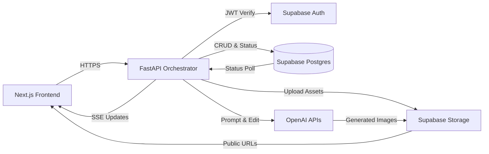

# Layerminder V1.0 🚀

Layerminder는 멀티 레이어 제품 이미지를 AI 파이프라인으로 큐레이션하는 팀 협업 플랫폼임 🎨
디자인팀이 Supabase 기반 비동기 백엔드를 통해 생성 결과를 함께 공유함 🤝

## 시스템 아키텍처 🧱
- **Monorepo 구성**: FastAPI 백엔드와 Next.js 프론트엔드가 하나의 repo에서 버전 잠금 유지함
- **계층 분리**: `routers` → `services` → `core` 순으로 라우팅과 도메인 로직을 모듈화함
- **데이터 허브**: Supabase Postgres와 Supabase Storage가 모든 메타데이터와 생성 자산을 저장함
- **보안**: Supabase Auth JWT를 FastAPI 의존성으로 주입하여 전 엔드포인트 인증을 강제함
- **이벤트 스트림**: Server-Sent Events(SSE)로 이미지, 스토리, 키워드, 추천 정보를 순차 푸시함

### 전체 프로세스 다이어그램 🔁

## Tech Stack 🧩
| Layer | Stack | Notes |
| --- | --- | --- |
| Frontend | Next.js 14, React 18, TypeScript, Tailwind CSS | 대시보드와 애니메이션 UI를 위한 App Router 구성 |
| Backend | FastAPI, Uvicorn, Pydantic v2 | 비동기 라우팅과 강타입 스키마 검증 |
| Data | Supabase Postgres, Supabase Storage | 생성 이력 테이블과 공개 이미지 버킷 |
| Identity | Supabase Auth (JWT) | Passwordless 기반 세션 관리 |
| AI Services | OpenAI gpt-image-1, gpt-4.1-nano | 이미지 합성 및 스토리·키워드 생성 |
| Tooling | Poetry, pnpm, GitHub Actions | Python 패키징, 프론트엔드 패키지, CI 자동화 |

## 주요 API 흐름 🔍
- `POST /api/v1/generate`
  - 이미지 키 목록과 키워드를 받아 백그라운드 태스크로 전체 파이프라인을 시작함 (image+story+recommendation)
  - 신용(credit) 차감 로직과 Supabase `history_records` 초기 상태 기록 포함
- `GET /api/v1/stream/{record_id}`
  - SSE(Server-Sent Events)로 `images_generated`, `story_generated`, `keywords_generated`, `recommendation_generated` 이벤트를 전송함
  - 프론트엔드는 진행 단계별 UI 갱신 및 에러 핸들링 수행 (step aware)
- `GET /api/v1/history_sessions/images`
  - 사용자별 생성 이력과 추천 이미지를 통합 조회함 (gallery feed용 JSON)

## AI 생성 파이프라인 요약 🤖
1. Supabase Storage에서 입력 이미지를 비동기로 불러오고 OpenAI `gpt-image-1` 편집 API로 4개의 후보를 생성함
2. 생성 이미지 메타데이터를 Supabase `images`, `history_record_images` 테이블에 저장하고 공개 URL을 발급함
3. 첫 번째 생성 이미지를 `gpt-4.1-nano`에 전달하여 제품 스토리와 12개의 키워드를 생성함
4. `services.recommendation.recommend_image`가 동일 세션 내 후보를 비교해 가장 유사한 레퍼런스 이미지를 추천함
5. 모든 상태가 `ready`가 되면 SSE `done` 이벤트로 프론트엔드를 마무리시킴

## 운영 및 배포 ⚙️
- **환경 변수 관리**: `core/config.py`가 `.env` 값을 읽어 OpenAI 키와 Supabase 자격 증명을 주입함
- **배포 파이프라인**: Docker 이미지를 빌드하여 FastAPI는 컨테이너, 프론트엔드는 Vercel에 배포함
- **관측성**: Supabase 대시보드와 FastAPI 로그를 조합해 파이프라인 단계별 지표를 추적함

## 빠른 시작
1. 백엔드: `cd layerminderBE && poetry install && poetry run uvicorn run:app --reload`
2. 프론트엔드: `cd layerminderFE/frontend && pnpm install && pnpm dev`
3. 필수 시크릿: `.env`에 Supabase URL·Service Role Key, OpenAI Key, 스토리지 버킷 이름을 설정함

## 품질 관리 🛡️
- Pytest 기반 비동기 단위 테스트를 준비하고 CI에서 OpenAI 호출을 모킹함
- GitHub Actions 워크플로가 백엔드 패키지 빌드와 주요 라우터 스모크 테스트를 수행함
- 프론트엔드는 pnpm lint, 백엔드는 Poetry lock 검증을 통해 의존성 일관성을 유지함

## 로드맵
- 추천 알고리즘에 메타데이터 임베딩 기반 후보 스코어링 추가 계획
- SSE 성능 튜닝과 재시도 로직 강화를 통해 대규모 동시 접속 대응 예정
- 디자이너 맞춤형 세션 분석 리포트를 대시보드에 시각화 예정
